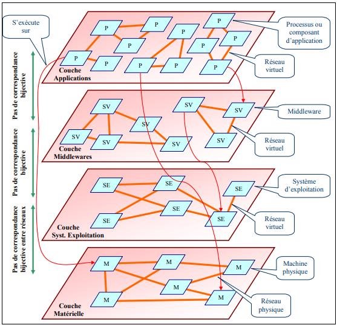

- [1. Définitions des systèmes distribués](#1-définitions-des-systèmes-distribués)
- [2. Systèmes distribués vs parallèles](#2-systèmes-distribués-vs-parallèles)
  - [1. Parallèles](#1-parallèles)
  - [2. Distribués](#2-distribués)
- [3. Taxonomie des systèmes distribués](#3-taxonomie-des-systèmes-distribués)
  - [Taxonomie coté matériel](#taxonomie-coté-matériel)
    - [A. Multiprocesseurs (mémoire partagée)](#a-multiprocesseurs-mémoire-partagée)
      - [1. Bus](#1-bus)
      - [2. Switch](#2-switch)
    - [B. multiordinateurs (mémoire locale)](#b-multiordinateurs-mémoire-locale)
      - [1. Bus](#1-bus-1)
      - [2. Switch](#2-switch-1)
  - [Taxonomie coté systeme d'exploitation](#taxonomie-coté-systeme-dexploitation)
    - [1. Categories des systèmes d’exploitation](#1-categories-des-systèmes-dexploitation)
      - [A. Les systèmes fortement couplés](#a-les-systèmes-fortement-couplés)
      - [B. Les systèmes faiblement couplés](#b-les-systèmes-faiblement-couplés)
    - [2. Types des systèmes d’exploitation distribués](#2-types-des-systèmes-dexploitation-distribués)
      - [A. Les systèmes d’exploitation des plateformes multiprocesseurs (MPOS)](#a-les-systèmes-dexploitation-des-plateformes-multiprocesseurs-mpos)
      - [B. Les systèmes d’exploitation multiordinateurs (MCOS).](#b-les-systèmes-dexploitation-multiordinateurs-mcos)
- [4. Caractéristiques d’un système distribué](#4-caractéristiques-dun-système-distribué)
  - [1. Transparence](#1-transparence)
  - [2. Prise en charge des pannes partielles](#2-prise-en-charge-des-pannes-partielles)
    - [2.1. Détection des pannes](#21-détection-des-pannes)
  - [3. Passage à l’échelle](#3-passage-à-léchelle)
  - [4. Disponibilité](#4-disponibilité)
  - [5. Autonomie](#5-autonomie)
  - [6. La mémoire répartie](#6-la-mémoire-répartie)
  - [7. Echange de messages](#7-echange-de-messages)
- [5. Types des systèmes distribués](#5-types-des-systèmes-distribués)
- [6. Domaines d’application des systèmes distribués](#6-domaines-dapplication-des-systèmes-distribués)
- [7. Les avantages et les inconvénients des systèmes distribués](#7-les-avantages-et-les-inconvénients-des-systèmes-distribués)
  - [1. Avantages](#1-avantages)
  - [2. Inconvénients](#2-inconvénients)
    - [1. L'absence d'une horloge globale](#1-labsence-dune-horloge-globale)
    - [2. La lenteur de la communication](#2-la-lenteur-de-la-communication)
- [9. Les Problèmes des systèmes distribués](#9-les-problèmes-des-systèmes-distribués)
  - [1. Hétérogénéité](#1-hétérogénéité)
  - [2. Concurrence](#2-concurrence)
  - [3. Sécurité](#3-sécurité)
  - [4. Pannes](#4-pannes)
  - [5. Absence des informations globales](#5-absence-des-informations-globales)
- [10. Quelque exemple des systèmes distribués](#10-quelque-exemple-des-systèmes-distribués)
  - [1. Systèmes P2P](#1-systèmes-p2p)
  - [2. Grilles informatiques ou grid :](#2-grilles-informatiques-ou-grid-)
  - [3. Cloud :](#3-cloud-)
  - [4 Internet](#4-internet)
  - [5 Les systèmes mobiles](#5-les-systèmes-mobiles)

# 1. Définitions des systèmes distribués
- Un système distribué est une collection d’ordinateurs indépendants, connectés par 
un d’un réseau, qui apparaissent comme un seul ordinateur pour les utilisateurs 
du système.

- Les différents éléments du système ne fonctionnent pas indépendamment mais collaborent à une ou plusieurs tâches communes. 

- Une partie au moins de l’état global du système est partagée entre plusieurs éléments pour avoir un système distribué.

# 2. Systèmes distribués vs parallèles
## 1. Parallèles
- Possède un ensemble de processeurs **qui sont proches** (sur la meme machine), tous les processeurs ont accès à une **mémoire commune et 
partagée**. Cette mémoire commune permet d’échanger de l’information entre les processeurs.

- **L’architecture connectant les processeurs est prédéfinie**. La tâche à résoudre peut être découpée et répartie sur les processeurs. **Le 
but est d’exploiter au maximum la puissance de calcul du système**

- il est possible de **choisir l’algorithme (ou une partie)** 
qui sera exécuté par chaque processeur.

Figure 1 : Systèmes Parallèles.

## 2. Distribués
- Possède un ensemble de processeurs **interconnectés par un réseau informatique** comme internet, les processeurs peuvent être **géographiquement éloignés**. Chaque processeur possède **sa 
propre mémoire locale** et échange de l’information avec les autres processeurs à l’aide de 
**messages envoyés** via le réseau les connectant.

- Dans un système distribué, tous les processeurs exécutent le **même algorithme et celui-ci doit 
fonctionner quel que soit la topologie du réseau**.

  * Chaque processeur n’a qu’une vision partielle du système et doit communiquer avec les autres processeurs afin d’accomplir sa tâche. Ainsi, l’accent est mis sur la méthode collaborative pour résoudre une tache donnée.
  * 

Figure 2 : Systèmes distribués.

# 3. Taxonomie des systèmes distribués
Un système distribué peut être représenté par une classification de trois classes.
Les trois classes ou trois niveaux reflètent la structuration en couche de ce système.
- Materiel.
- Systemes d'exploitation.
- Applications et architecture.
  

Figure 3 : classification des systèmes distribués 

## Taxonomie coté matériel
D’un point de vu matériel, un système distribué physique peut être envisagé comme une 
collection de mémoires et de processeurs interconnectés de telle sorte à pouvoir 
communiquer. 

Figure 2. Interconnexion des processeurs et des modules de mémoire 

### A. Multiprocesseurs (mémoire partagée)
#### 1. Bus 
- Les processeurs est les modules de mémoire sont connectés à un bus commun, tous les modules de mémoire sont accessibles à n’importe quel processeur. Le bus constitue un goulot d’étranglement qui baisse considérablement les performances. Ce problème peut être réduit par l’utilisation de mémoires caches locales à chaque processeur, mais les caches doivent être maintenus cohérents, ce qui n’est pas une tâche facile.

#### 2. Switch
- Les processeurs et les modules de mémoire 
sont reliés par un réseau de communication (Multi-stage switch)

### B. multiordinateurs (mémoire locale)
Leurs construction plus simple que celle des systèmes multiprocesseurs.
#### 1. Bus 
- Construits à partir d’ordinateurs (processeur + mémoire) identiques (on les qualifie de systèmes homogènes). 
- Les processeurs sont reliés par un réseau multiaccès partagé (Tel que Fast Ethernet) et communiquent par diffusion de messages. Bien que la bande passante du réseau soit importante (de l’ordre de 100 Mbps), les systèmes ainsi construits ont une invariance à l’échelle limitée (25 à 100 noeuds).
  
#### 2. Switch
- échangent des messages par routage à travers un réseau 
d’interconnexion pouvant avoir plusieurs topologies, allant des grilles simples aux hypercubes.
- Les architectures en grilles, souvent présentées sur un seul circuit imprimé, 
conviennent pour les problèmes à deux dimensions (traitement d’images, théorie des graphes, 
etc.) Un hypercube est un cube à n-dimensions où chaque nœud (un processeur) est relié à n autres 
nœuds processeurs. Les hypercubes conviennent à la résolution de problèmes spécifiques tels
que le calcul matriciel. 
- Les systèmes basés switchs peuvent avoir des configurations très 
variées allant jusqu’à des superordinateurs massivement parallèles (MPP : Massively Parallel 
Processors) contenant des milliers de processeurs et dont le coût se chiffre en millions de 
dollars.
- Les systèmes multiordinateurs hétérogènes sont les plus utilisés actuellement. Les ordinateurs 
peuvent avoir des structures et des performances nettement différentes et sont reliés par des 
réseaux hétérogènes.

## Taxonomie coté systeme d'exploitation
Il existe une relation étroite entre les applications distribuées et les systèmes d’exploitation. 

- La mise en œuvre des applications distribuées dépend des systèmes d’exploitation qui gèrent les différentes plateformes matérielles (i.e. les services qu’ils offrent).
- Les systèmes d’exploitation peuvent être distribués (cas du système d’exploitation Chorus de Sun)

### 1. Categories des systèmes d’exploitation
On peut diviser les systèmes d’exploitation en deux catégories :
#### A. Les systèmes fortement couplés
- Le système d’exploitation essaye de maintenir une vue globale unique des ressources qu’il gère.
- Ce type de système à tendance à rendre la répartition physique transparente au niveau des applications.
#### B. Les systèmes faiblement couplés
- Une collection de plateformes ou chacune dispose de son propre système d’exploitation mais ces derniers coopèrent pour rendre leurs services et leurs ressources disponibles les uns aux autres, il s’agit des systèmes d’exploitation réseau.

Notons qu’il est important de signaler que les systèmes d’exploitation constituent, eux aussi, des applications distribuées. Cependant, contrairement à ces dernières, ils sont implantés directement sur les plateformes matérielles et en dépendent fortement

### 2. Types des systèmes d’exploitation distribués
On en distingue deux types de systèmes d’exploitation distribués :
#### A. Les systèmes d’exploitation des plateformes multiprocesseurs (MPOS)
- Considérés comme des systèmes répartis particuliers les MPOS sont conçu pour supporter les hautes performances en utilisant des processeurs multiples. Un des buts des MPOS est de rendre le nombre des processeurs transparent pour les applications. Dans ces systèmes, les processus communiquent via l’utilisation de données situées dans des emplacements de mémoire partagés. La protection de ces emplacements est faite par des sémaphores ou des moniteurs.
#### B. Les systèmes d’exploitation multiordinateurs (MCOS).
- Les MCOS ont une structure totalement différente et complexe par rapport aux MPOS. Ceci est du au fait que les structures de données communes ne peuvent être simplement placées dans une mémoire physique partagée. L’unique moyen de communication et l’envoi de messages.

- Chaque nœud du réseau possède un système d’exploitation qui permet de gérer les ressources locales : mémoire, processeur, disque, … . De même, chaque nœud possède un module chargé de la communication entre plateformes (envoi et réception de messages). 
- Sur chaque noyau on greffe une couche commune qui implémente une machine virtuelle capable d’exécuter des tâches parallèles et concurrentes. Cette couche peut faire apparaître tout le système d’ordinateurs comme une machine multiprocesseur en implémentant une mémoire partagée. D’autres services sont assignés à cette couche : affecter une tâche à un processeur, masquer les pannes matérielles, assurer la transparence à la localisation et la communication interprocessus.

La programmation des systèmes MCOS est beaucoup plus difficile que la programmation des systèmes MPOS. La raison est que l’utilisation d’une mémoire partagée avec une protection par sémaphores ou moniteurs est plus simple que la manipulation des messages.  
Cette constatation est derrière la solution qui consiste à créer des MCOS en modifiant les MPOS par l’émulation d’une mémoire partagée virtuelle à partir de la mémoire virtuelle de chaque nœud.
- Par exemple, on peut utiliser la pagination et avoir une mémoire répartie partagée basée sur la pagination. Les pages sont alors réparties sur tous les nœuds et on maintient une table globale des pages qui indique l’emplacement des pages sur les nœuds. C’est essentiellement la pagination classique excepté qu’au lieu d’utiliser le disque local, on utilise la mémoire virtuelle distante. Lorsqu’un processeur génère une référence d’une page qui n’est pas présente localement, un déroutement à lieu, le MCOS cherche la page et la ramène dans la mémoire locale au processeur ayant généré la référence, ce dernier pourra alors continuer son exécution.

# 4. Caractéristiques d’un système distribué
Un système distribué doit assurer plusieurs propriétés pour être considéré comme performant.

## 1. Transparence
La transparence permet de cacher aux utilisateurs les détails techniques et organisationnels d’un système distribué ou complexe. L’objectif est de pouvoir faire bénéficier aux applications une multitude de services sans avoir besoin de connaître exactement la localisation ou les détails techniques des ressources qui les fournissent. Ceci rend plus simple, le développement des applications, mais aussi leur maintenance évolutive ou corrective. Selon la norme la transparence a plusieurs niveaux : 
1. **Accès** : cacher l’organisation logique des ressources et les moyens d’accès à une ressource.
2. **Localisation** : l’emplacement d’une ressource du système n’a pas à être connu. 
3. **Migration** : une ressource peut changer d’emplacement sans que cela ne soit aperçu. 
4. **Relocalisation** : cacher le fait qu’une ressource peut changer d’emplacement au moment où elle est utilisée. 
5. **Réplication** : les ressources sont dupliquées, mais les utilisateurs n’ont aucune connaissance de cela. 
6. **Concurrence** : correspond au fait qu’un ensemble de machines indépendantes tentent d’accéder simultanément à une même ressource ou à un ensemble de ressources partagées. Il 
est alors nécessaire de conserver cette ou ces ressources dans un état cohérent. Nous 
étudierons deux mécanismes permettant cela. Nous verrons que le problème de concurrence 
est déjà présent dans les environnements d’exécution locaux à processus légers, ce qui permet 
de le gérer de façon transparente dans un environnement d’exécution distribuée. Nous 
étudierons les contraintes qu’il est alors nécessaire d’imposer pour assurer le respect de la 
cohérence de l’application d’origine

## 2. Prise en charge des pannes partielles
Les pannes dans un système distribué peuvent être de différente nature et affecter divers composants. Une panne peut être :
1. **Franche** : correspondra généralement à un crash, c’est-à-dire que le processus cessera de répondre à toute requête ou d’émettre des requêtes. 
2. **Transitoire** ou **Intermittente** : au contraire, la panne apparaîtra à un instant donné puis le processus fonctionnera à nouveau correctement. 
3. **Byzantines** : caractérisées par un comportement déviant du 
processus affecté : ce dernier ne respecte plus sa spécification, soit à cause d’une opération malveillante, soit en raison d’une erreur logicielle ou encore à la suite d’une erreur physique non détectée comme une erreur mémoire.

Quel que soit le type de panne qui apparaisse, une première difficulté consiste à la détecter avant de pouvoir la gérer

### 2.1. Détection des pannes
En général, un mécanisme de détection de panne dans un système distribué décrète un délai –time out – au-delà duquel, si aucune réponse n’a été reçue, le processus est considéré comme étant en panne. 
- Dans un système synchrone pour lequel le délai maximum de communication et de traitement d’une requête est connu, ce système détectera les pannes correctement. 
- Cependant, dans un système totalement asynchrone et pour lequel les délais de réponse ne sont pas prévisibles, comme c’est le cas pour la plupart des systèmes distribués, cette méthode ne permettra pas de distinguer un processus en panne d’un processus très lent. 
- Ce phénomène abouti à l’impossibilité de la résolution de certains problèmes en présence d’une panne, notamment celui du consensus. Dans lequel un ensemble de processus doivent se mettre d’accord sur une valeur commune

## 3. Passage à l’échelle

Le concept de passage à l’échelle désigne la capacité d’un système à continuer à délivrer avec un temps de réponse constant un service même si le nombre de clients ou de données augmente de manière importante.   
Le passage à l’échelle peut être mesuré avec au moins trois 
dimensions : 
1. Le nombre d’utilisateurs et/ou de processus (passage à l’échelle en taille). 
2. La distance maximale physique qui sépare les nœuds ou ressources du système (Passage à l’échelle). 
3. Le nombre de domaines administratifs (passage à l’échelle administrative)

## 4. Disponibilité
Un système est dit disponible s’il est en mesure de délivrer correctement le ou Les services de manière conforme à sa spécification. Pour rendre un système disponible il faut donc le rendre capable de faire face à tout obstacle qui peut compromettre son bon fonctionnement. En effet, l’indisponibilité d’un système peut être causée par plusieurs sources parmi lesquelles nous pouvons citer : Les pannes qui sont des conditions ou évènements accidentels empêchant le système, ou un de ses composants, de fonctionner de manière conforme à sa spécification. Les surcharges qui sont des sollicitations excessives d’une ressource du système entraînant sa congestion et la dégradation des performances du système

## 5. Autonomie
- Un système ou un composant est dit autonome si son fonctionnement ou son intégration dans un système existant ne nécessite aucune modification des composants du système hôte.
- L’autonomie des composants d’un système favorise l’adaptabilité, l’extensibilité et la réutilisation des ressources de ce système.
- Par exemple, une ressource autonome peut être remplacée avec une autre ressource plus riche en termes de fonctionnalités, ce qui étend les services du système. La confiance entre les différentes machines d’un système distribué est un élément essentiel. 

Nous ajoutons donc cette caractéristique aux quatre précédentes. Dès lors que l’ensemble des machines participant à un système distribué ne sont pas toutes gérées et administrées par la même organisation, des problèmes de confiance entre ces machines apparaissent. Il est nécessaire de proposer des mécanismes pour gérer cette confiance et assurer une certaine protection en son absence

## 6. La mémoire répartie
- La mémoire répartie est une caractéristique constitutive des systèmes distribués. 
- Chaque machine participant à un système distribué possède sa propre mémoire, son propre espace d’adressage et éventuellement ses propres périphériques de stockage permanents. 
- La mémoire de l’ensemble du système est donc répartie dans le sens où une partie des données se trouve sur un site, une autre partie sur un autre et certaines données peuvent éventuellement être dupliquées. 
- La prise en charge de cette répartition implique la mise en œuvre de mécanismes de communication pour l’échange de données entre les différents sites. 
  * Cet échange peut être :
  1. **explicite**, par l’utilisation d’une bibliothèque de communication. 
  2. **abstrait** dans la notion d’appel de routine à distance.
  3. **implicite** dans le cas d’une mémoire virtuellement partagée.

## 7. Echange de messages
- L’échange de messages est vraisemblablement la méthode le plus basse niveau, ou en tout cas la plus proche du modèle d’exécution sous-jacent. 
- Pour qu’une machine A connaisse une information contenue sur une machine B, cette dernière doit envoyer un message contenant cette information à la machine A. 
- Cet envoi de message est explicite au niveau du paradigme de programmation et doit être pris en charge par le développeur
  
# 5. Types des systèmes distribués
- Les systèmes distribués architecturés autour de **systèmes d'exploitation orientés 
réseaux**. 

- Les systèmes distribués reposants sur des **systèmes d'exploitation auxquels sont
ajoutées des fonctionnalités**.
  * Ces systèmes permettent de gérer, de façon plus ou moins évidente, l’hétérogénéité des différents hôtes. 

- Les systèmes distribués reposant sur **système d'exploitation complètement distribué**. 
  * Dans ce cas, le noyau lui-même possède tous les outils pour prendre sous sa responsabilité la communication inter processus synchrone. Ces systèmes ne gèrent pas directement l’hétérogénéité des différents hôtes.

# 6. Domaines d’application des systèmes distribués 
- Ingénierie simultanée
- Coopération d’équipes pour la conception d’un produit
- Production coopérative de documents
- Partage cohérent d’information
- Gestion intégrée des informations d'une entreprise
- Intégration de l’existant
- Contrôle et organisation d’activités en temps réel 
- Centres de documentation, bibliothèques
- Recherche, navigation, visualisation multimédia. 

# 7. Les avantages et les inconvénients des systèmes distribués
## 1. Avantages
1. Performance
2. Robustesse
3. Evoluvité
4. Securite
5. Acceleration des calculs
6. Transparence
7. Flexibilité
8. Fiabilité
9. Communication entre les systemes
10. Acces distant

## 2. Inconvénients
### 1. L'absence d'une horloge globale
chaque nœud possède sa propre horloge pour dater les 
événements qui lui sont locaux. Par conséquent, si les horloges indépendantes de chaque 
nœud ne sont pas parfaitement synchronisées, l'ordre des événements n'est pas déductible à 
partir des datations locales. Cette difficulté conduira à définir des datations logiques qui 
permettent de corriger ce problème. 
### 2. La lenteur de la communication
Malgré le degré de fiabilité offert par les réseaux de communication, et les vitesses de transmission qu'ils proposent(avec l'arrivée des fibres optiques), les réseaux restent relativement, et on dit bien relativement lents par rapport à la vitesse de calcul sur les machines, ce qui implique un grand temps d'attente dans le cas d'un travail coopératif entre les processus, et donc on obtient une perte concernant la performance du système. La perte des messages : parfois, les réseaux de communication ne sont pas fiables, quelques messages transportés par ces réseaux peuvent être perdus, et donc on doit réémettre ces messages, les protocoles de détection, de perte, et la génération des nouveaux messages reste jusqu' à maintenant un des domaines de recherche dans les systèmes répartis.

# 9. Les Problèmes des systèmes distribués
Dans chaque couche de système distribué, il est possible d'avoir diverses entités reliées par un réseau qui est physique dans la couche matérielle et virtuel dans les couches. Chaque couche matérialise, à elle seule, un système distribué. Cependant, comme les entités de chaque couche s'exécutent en utilisant les services disponibles dans les inférieures, les applications distribuées sont donc mises en œuvre moyennant plusieurs systèmes distribués.la couche middleware est une couche spécifique pour les systèmes distribués. Qu’est censée cacher les subtilités des couches inférieures et offrir aux concepteurs des applications distribuées des services plus convenables de nature à réduire leur complexité

## 1. Hétérogénéité
Les composants d'un système distribués sont appelés à coopérer pour partager les ressources mais chaque composant peut avoir ses spécificités qui limitent ce partage ou le rendent difficile. L'hétérogénéité au niveau matériel vient de la différence qui existe entre les ordinateurs aussi bien qu'entre les réseaux. Dans un même système distribué, il est possible de trouver un ordinateur personnel, une station de travail sophistiquée ou même un ordinateur multiprocesseur puissant. 
## 2. Concurrence 
Le problème de la concurrence se pose pour les systèmes distribués comme pour les systèmes centralisés (i.e. multiprocesseurs).la gestion de la concurrence dans les systèmes distribués nécessite des mécanismes et des outils tout comme les systèmes centralisés(moniteurs, sémaphore).cependant, dans le cas des systèmes distribués, la gestion de la concurrence se base en partie sur la communication par messages et cette dernière introduit d'autres sources de difficultés, telles que la perte de messages ou leur corruption, d'en-t-il faut tenir compte . 
## 3. Sécurité 
Les problèmes de sécurité se posent pour tous les systèmes informatiques. Cependant, dans les systèmes distribués, la vulnérabilité se trouve accentuée par la répartition même. Ainsi, il est naturel dans le commerce électronique qu'une partie de l'application (un client) envoie des messages à un autre (un serveur).malheureusement le message peut être intercepté, lors de sa transmission, et son contenu divulgué, ce qui peut entrainer de conséquences graves aussi bien pour le client que pour le serveur. 
## 4. Pannes 
Les pannes peuvent apparaitront aussi dans les différentes couches et se propager éventuellement aux autres couches. L'origine des pannes peut être une raison matérielle ou une raison logique liée à la conception des applications, des middlewares et des systèmes d'exploitation. Certaines peuvent avoir comme origine une faille dans gestion de la concurrence ou la coordination en général. Les pannes d'ordre logiques sont innombrables du fait que les applications distribuées sont par nature même, complexes.
## 5. Absence des informations globales 
Dans le cas des systèmes distribués, la mémoire commune est inexistante. Chaque processus se trouve dans un environnement différent et son état est une information interne à ce dernier. De même, les informations sur les ressources partagées ne sont pas accessibles en temps réel.de ces faits, la coordination d'un ensemble de processus distribués nécessite le recours à la communication par échange de message. Malheureusement, un message parvient toujours à sa destination avec un certain retard et par conséquent l'information qu'il véhicule ne reflète pas toujours l'état d'un processus ou d'une ressource, car ces derniers peuvent changer d'état durant la transmission du message. Il est impossible d'avoir une globale instantanée de l'état d'un système distribué et cette situation rend la coordination dans ces derniers un véritable challenge. 

# 10. Quelque exemple des systèmes distribués

## 1. Systèmes P2P
Comme nous l’avons mentionné ci-avant, le terme P2P fait référence à une classe de systèmes 
distribués qui utilisent des ressources distribuées pour réaliser une tâche particulière de 
manière décentralisée. Les ressources sont composées d’entités de calcul (ordinateur ou 
PDA), de stockage de données, d’un réseau de communication, etc. La tâche à exécuter peut 
être du calcul distribué, du partage de données (ou de contenu), de la communication et 
collaboration, d’une plateforme de services, etc. La décentralisation, quant à elle, peut 
s’appliquer soit aux algorithmes, soit aux données, soit aux métadonnées, soit à plusieurs 
d’entre eux. L’une des particularités des systèmes P2P est que tous les nœuds (pairs) sont en 
général symétriques, c’est à dire qu’ils jouent à la fois le rôle de client et de serveur. En 
particulier, les systèmes de partage de fichiers permettent de rendre les objets d’autant plus 
disponibles qu’ils sont populaires, en les répliquant sur un grand nombre de nœuds. Cela 
permet alors de diminuer la charge (en nombre de requêtes) imposée aux noeuds partageant 
les fichiers populaires, ce qui facilite l’augmentation du nombre de clients et donc le passage 
à l’échelle en taille des données. Les pairs sont organisés autour d’une architecture qui peut 
être centralisée ou non. Dans l’architecture centralisée, un nœud joue le rôle de coordinateur 
central (serveur, ou index central) et gère soit les partages, soit la recherche, soit l’insertion 
d’informations et de nouveaux nœuds. Cependant l’échange d’informations entre nœuds se 
passe directement d’un nœud à l’autre. D’aucuns considèrent que de telles architectures ne 
sont pas pair-à-pair, car un serveur central intervient dans le processus. Par contre d’autres 
arguent que ce sont bien des systèmes pair-à-pair, car les fichiers transférés ne passent pas par 
le serveur central. Néanmoins, c’est une solution fragile puisque le serveur central est 
indispensable au réseau. Ainsi, s’il est en panne ou non accessible, tout le réseau s’effondre. 
En plus, le système n’est pas transparent puisque les nœuds ont besoin de savoir à tout 
moment l’emplacement de l’index et sont sensibles à tout changement de celui-ci. Un 
exemple de solution P2P centralisée est Napster (Nap), qui utilise un serveur pour stocker un 
index ou pour initialiser le réseau .
Pour faire face à ces insuffisances, une architecture distribuée s’impose, puisqu’un noeud 
pourrait solliciter plusieurs serveurs en même temps. Le système est ainsi plus robuste, mais 
la recherche d’informations est plus difficile. Elle peut s’effectuer dans des systèmes 
décentralisés non-structurés, comme Gnutella (Gnu). Dans ce système, la recherche se fait par 
propagation de la requête aux voisins jusqu’à trouver les résultats, ce qui nécessite dès lors un 
nombre de messages élevé, proportionnel au nombre d’utilisateurs du réseau (et exponentiel 
suivant la profondeur de recherche). Dans les systèmes décentralisés structurés, une 
organisation de connexion et de répartition des objets partagés est maintenue entre les nœuds. 
Souvent cette organisation est basée sur les tables de hachage distribuées, permettant de 
réaliser des recherches en un nombre de messages croissant de façon logarithmique avec le 
nombre d’utilisateurs du réseau, comme CAN, Chord, Kademlia, Pastry, etc. Une autre 
solution possible est l’utilisation de « super-pairs », nœuds du réseau choisis en fonction de 
leur puissance de calcul et de leur bande passante, réalisant des fonctions utiles au système 
comme l’indexation des informations et le rôle d’intermédiaire dans les requêtes. Cette 
solution que l’on retrouve dans Kazaa (KaZ), rend le système un peu moins tolérant aux 
pannes que les systèmes complètement décentralisés et englobe un peu l’idée de client-serveur entre pairs et super-pairs. Comme tous les nœuds sont au même niveau avec les 
architectures complètement distribuées, celle-ci offrent plus de transparence dans 
l’organisation et la localisation des ressources que les architectures centralisées ou semi-centralisées (super-pairs). Les systèmes P2P soulèvent plusieurs problèmes bien qu’ils 
facilitent le passage à l’échelle et la disponibilité des ressources avec un faible coût. Il faut 
noter en premier lieu que les nœuds du système sont totalement autonomes et donc qu’ils 
peuvent choisir de partager ou non leur CPU et leur capacité de stockage. Cette autonomie 
leur confère aussi le choix de rejoindre ou quitter le système à tout moment. Cela a pour effet 
de compromettre la capacité de calcul totale et réelle du système, mais aussi la disponibilité 
des ressources (informations, capacité de stockage, etc.). En second lieu, le système de 
communication utilisé est de faible bande passante (en général Internet), ce qui peut créer une 
surcharge du système et une latence plus élevée que dans les clusters. Enfin, l’absence 
d’infrastructures de contrôle sur les systèmes P2P rend ces derniers moins pratiques pour 
prendre en compte certains types d’applications qui exigent une grande qualité ou des services 
transactionnels. Néanmoins, les systèmes P2P sont devenus incontournables aujourd’hui dans 
le domaine du partage de fichiers, de la recherche d’informations et de la collaboration . 
## 2. Grilles informatiques ou grid :
Le terme anglais grid désigne un système distribué d’électricité. Initialement, le concept de 
grille partait du principe d’un tel système : les ressources d’un ordinateur (processeur, 
mémoire, espace disque) étaient mises à la disposition d’un utilisateur aussi facilement que 
l’on branche un appareil électrique à une prise électrique. Une grille informatique est une 
infrastructure virtuelle constituée d’un ensemble de ressources informatiques potentiellement 
partagées, distribuées, hétérogènes, délocalisées et autonomes. Une grille est en effet une 
infrastructure, c’est-à-dire des équipements techniques d’ordre matériel et logiciel. Cette 
infrastructure est qualifiée de virtuelle, car les relations entre les entités qui la composent 
n’existent pas sur le plan matériel, mais d’un point de vue logique. D’un point de vue 
architectural, la grille peut être définie comme un système distribué constitué de l’agrégation 
de ressources réparties sur plusieurs sites et mises à disposition par plusieurs organisations 
différentes. Un site est un lieu géographique regroupant plusieurs ressources informatiques 
administrées de manière autonome et uniforme. Il peut être composé d’un supercalculateur ou 
d’une grappe de machines (cluster). Contrairement aux systèmes P2P, une grille garantit des 
qualités de service non triviales, c’est-à-dire qu’elle répond adéquatement à des exigences 
(accessibilité, disponibilité, fiabilité, ...) compte tenu de la puissance de calcul ou de stockage 
qu’elle peut fournir. Il existe plusieurs projets de grilles qui on été mis en place aussi bien à 
des échelles nationales qu’internationales : la grille expérimentale française Grid’5000, la 
grille de calcul scientifique nord-américain TeraGrid, la grille chinoise CNGrid, la grille Asie-Pacifique ApGrid , etc. Les grilles informatiques sont caractérisées par une forte hétérogénéité 
et une grande dynamicité.
En effet, les machines d’une grappe sont reliés par un réseau gigabits alors que les sites sont 
liés par un réseau WAN, dont la latence peut aller jusqu’à 100 millisecondes. De là, nous 
pouvons noter une différence importante de la latence entre deux machines d’un même site et 
celle entre deux machines de deux sites. En outre, chaque site est administré de manière 
autonome et par conséquent les politiques de sécurité varient d’un site à l’autre. Un autre 
exemple d’hétérogénéité relève de la composition interne d’un site. Chaque site est libre de 
choisir le type de processeur de ses machines (Intel, AMD, IBM, ...), la capacité de stockage 
et le réseau d’interconnexion entre machines (Gigabit Ethernet, Infiniband, ...). Enfin 
l’infrastructure d’une grille est composée d’un nombre important de sites et de machines qui 
sont susceptibles de tomber en panne à tout moment. À cela s’ajoute le fait que de nouveaux 
sites peuvent être ajoutés ou retirés de la grille sans trop impacter le fonctionnement de la 
grille. De par leur hétérogénéité, leur gestion décentralisée et leur taille, les grilles sont des 
infrastructures très complexes à mettre en oeuvre. La transparence n’est assurée qu’à moitié 
parce qu’ il faut avoir une information précise des ressources dans un site pour pouvoir 
distribuer les tâches convenablement. Cependant à l’intérieur d’un site, la machine qui 
effectue concrètement la tâche n’est pas connue en général .
## 3. Cloud :
Le cloud est un concept plus récent dont une définition unanime tarde à voir le 
jour. Cette divergence découle des principes considérés par les chercheurs pour définir le 
cloud. En effet, certains auteurs mettent l’accent sur le passage à l’échelle et la mutualisation 
de l’usage des ressources alors que d’autres privilégient le concept de virtualisation ou le 
business model (collaboration et pay-as-you-go). Cependant, il est unanimement reconnu que 
le cloud permet l’utilisation de la mémoire et des capacités de calcul des ordinateurs et des 
serveurs répartis dans le monde entier et liés par un réseau, tel Internet. Les ressources sont en 
général logées dans des data centres qui sont géographiquement distribués dans l’optique de 
garantir le passage à l’échelle et la disponibilité. Avec le cloud, les utilisateurs ne sont plus 
propriétaires de leurs serveurs informatiques, mais peuvent ainsi accéder de manière évolutive 
à de nombreux services en ligne sans avoir à gérer l’infrastructure sous-jacente, souvent 
complexe. C’est pourquoi, on peut considérer le cloud comme une extension des ASP. Les 
applications et les données ne se trouvent plus sur l’ordinateur local, mais dans un nuage 
(cloud) composé d’un certain nombre de serveurs distants interconnectés au moyen d’une 
excellente bande passante indispensable à la fluidité du système. L’accès au service se fait par 
une application standard facilement disponible, la plupart du temps un navigateur Web. Les 
services offerts par le cloud sont nombreux parmi lesquels nous avons : 
- Infrastructure as a service (IaaS) : c’est un service qui donne à l’utilisateur un 
ensemble de ressources de traitement et de stockage dont il a besoin à un instant précis 
pour effectuer ses tâches. 
- Platform as a Service (PaaS) : ce service, en dehors de fournir une infrastructure 
virtuelle, assure aussi la plateforme logicielle pour que les applications de l’utilisateur 
puissent tourner.
- Software as a Service (SaaS) : c’est une alternative de toute application locale.
    
Un exemple de ce cas est l’utilisation en ligne de la suite bureautique de Microsoft Office.
Pour assurer ces services qui varient d’un utilisateur à un autre, l’architecture des clouds est 
composée à son niveau le plus basique d’une couche logique composée d’un ensemble de 
machines virtuelles et d’une couche physique composée de data centres. Ainsi, plusieurs 
machines virtuelles peuvent être démarrées dynamiquement sur une seule machine physique 
pour satisfaire les besoins de plusieurs services. Les data centres qui regroupent les machines 
physiques sont en général répartis sur des sites géographiquement distants afin d’assurer une 
haute disponibilité. En plus cette répartition permet aussi d’assurer un niveau de performances 
élevé en branchant un utilisateur sur le site le plus proche de son emplacement afin de réduire 
les délais de communication. La mutualisation du matériel permet d’optimiser les coûts par 
rapport aux systèmes conventionnels et de développer des applications partagées sans avoir 
besoin de posséder ses propres machines dédiées au calcul. Comme pour la virtualisation, 
l’informatique dans le nuage est plus économique grâce à son évolutivité. En effet, le coût est 
fonction de la durée de l’utilisation du service rendu et ne nécessite aucun investissement 
préalable (homme ou machine). Notons également que l’élasticité du nuage permet de fournir 
des services évolutifs et donc de supporter les montées de charges. Par exemple, 
Salesforce.com, pionnier dans le domaine de l’informatique dans le nuage gère les données de 
54 000 entreprises, et leurs 1,5 millions d’employés, avec seulement 1000 serveurs (mars 
2009). De plus, les services sont extrêmement fiables, car basés sur des infrastructures 
performantes possédant des politiques efficaces de tolérance aux pannes (notamment des 
répliques). Grâce à ses avantages, on assiste aujourd’hui à une multiplication rapide 
d’entreprises qui proposent des solutions cloud parmi lesquelles figurent : Amazon, IBM, 
Microsoft, Google, etc. Cependant, le problème fondamental reste d’une part la sécurisation 
de l’accès à l’application entre le client et le serveur distant. On peut aussi ajouter le problème 
de sécurité générale du réseau de l’entreprise : sans le cloud computing, une entreprise peut 
mettre une partie de son réseau en local et sans aucune connexion (directe ou indirecte) à 
internet, pour des raisons de haute confidentialité par exemple ; dans le cas du cloud 
computing, elle devra connecter ces postes à internet (directement ou pas) et ainsi les exposer 
à un risque d’attaque ou a des violations de confidentialité.
## 4 Internet 
Est une vaste collection de réseaux d’ordinateurs interconnectés. Les programmes qui 
s’exécutent sur ces ordinateurs interagissent par l’échange de messages en utilisant un moyen 
de communication ou un autre. La mise en œuvre des moyens de communication constitue un 
défi considérable qui a permis à un ordinateur quelconque d'échanger des messages avec 
n'importe quel autre ordinateur dans le réseau. Internet constitue actuellement le système 
distribué le plus large au monde et ceci sur quasiment tous les plans. Des utilisateurs de 
n’importe quelle position dans le monde peuvent utiliser les services offerts par le www 
(world Wilde web), le FTP (file transfert protocole), et autres applications. Les services 
disponibles peuvent être étendus librement et le système peut être agrandi par l'ajout 
d'ordinateurs à n'importe quel moment. 
## 5 Les systèmes mobiles
Le progrès dans la miniaturisation et les réseaux sans fil laisse envisager le concept de 
l’espace d’information totalement connecté ou chaque entité dotée certaine fonctionnalité est 
connectée aux autres entités moyennant des dispositifs électroniques et des liaisons sans fil. 
Ces liaisons permettent à chacune d’avoir des informations sur les autres et éventuellement 
invoquer les services qu’elles offrent. Comme la majorité des entités sont dynamiques ont a 
affaire à des systèmes mobiles. Le partage de ressources dans de tels systèmes est une tâche 
complexe qui nécessite une certaine forme d’organisation et des mécanismes et protocoles ad 
hoc. 
