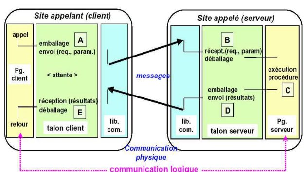

**Chapitre 3: Mécanismes de communication dans les systèmes distribués** 

1. **Introduction** 

La communication permet aux objets de système distribué de collaborer est de faire parvenir une information transmise par un processus à un autre processus.  Dans les systèmes  distribués,  la  communication  se  fait  par  message.   Il  est  existe  d’autres mécanismes  de communication plus évolués qui font appel à  la communication par message.  Il  s’agit  de  l’appel  de  procédure  à  distance  (Remote  Procedure  Call  ou simplement RPC), de l’invocation de méthode à distance (Remote Method Invocation ou simplement RMI) et de la notification d’événements [1][2].  

2. **LE PASSAGE DE MESSAGES** 

La communication par message est supportée par deux primitives de communication qu’on peut nommer *Send* et *Receive*. Un processus P communique avec un processus Q en lui envoyant une séquence d’octet au moyen de la primitive Send. Q reçoit cette séquence en utilisant la primitive Receive. 

L’implémentation  de  Send  et  Receive  soulève  deux  problèmes  particuliers  :  la synchronisation et l’établissement d’un canal de communication. 

<table><tr><th colspan="1" rowspan="2" valign="top"></th></tr>
<tr><td colspan="1" valign="top"></td></tr>
</table>
1. **Problème de la synchronisation lors de la communication**  

Avant  de  pouvoir  échanger  une  information,  les  processus  doivent,  souvent,  se synchroniser d’abord (i.e. l’un attend l’autre). On distingue plusieurs possibilités selon que les primitives Send et Receive soient bloquantes ou non pour le processus qui les exécute.  Lorsque  Send  et  Receive  sont  toutes  les  deux  bloquantes,  on  parle  de communication synchrone. Dans ce cas, si un processus exécute Send avant que l’autre n’exécute le Receive, le processus émetteur reste bloqué en attente et inversement. Le déblocage aussi bien de l’émetteur que du récepteur, intervient lorsque le processus receveur reçoit le message et son exécution est relancée. 

Dans  la  forme  asynchrone  de  communication,  le  Send  n’est  pas  bloquant  pour l’émetteur. Il consiste à mettre le message dans un buffer et le système d’exploitation se chargera de le faire parvenir à destination. Le processus émetteur continue alors son exécution sans attendre que le message parvienne à sa destination. Si le buffer dédié à la communication est plein le Send devient une opération bloquante jusqu’à ce qu’une place se libère. Autrement dit, le processus ne continue son exécution que lorsque le système d’exploitation prend en charge l’envoi du message. 

Le Receive peut être bloquant ou non. Dans le cas ou le Receive est non bloquant, le receveur continue son exécution après l’opération Receive qui consiste, alors, à spécifier seulement un buffer qui accueillera le message. Une fois le buffer rempli, le Receveur sera informé par interruption ou par scrutation. Le Receive non bloquant est difficile à mettre en œuvre et est peu utilisé car il rend la logique de programmation complexe. 

2. **Problème du canal de communication** 

Un  canal  de  communication  est  défini  par  la  paire  (Expéditeur,  Destinataire).  Une solution simple serait la spécification d’un canal de communication en utilisant les noms des processus. Cette approche présente l’inconvénient de ne pas convenir aux systèmes répartis  car,  on  ne  connaît  pas  préalablement  les  noms  des  processus,  de  plus,  ces processus peuvent provenir de programmes qui ont été développés indépendamment les uns  des  autres.  Autrement  dit  chaque  processus  peut  avoir  un  espace  de  nommage différent non connu au moment de la compilation des programmes des autres processus. Même si ces noms sont connus au moment de la compilation, il faut aussi connaître leur équivalent après compilation pour pouvoir mettre les processus en correspondance. Ce qui  complique  encore  les  choses,  c’est  le  fait  qu’un  processus  serveur  est  souvent développé pour servir plusieurs clients préalablement inconnus. 

Dans les systèmes actuels, le canal de communication consiste en une paire de *Socket* (qu’on peut traduire littéralement par Prise), un pour l’émetteur et un pour le récepteur. La communication consiste, alors, à transmettre des messages entre les deux sockets. C’est le cas dans les systèmes BSD Unix, Windows et MacOS. 

Un socket n’est autre qu’un port et une adresse Internet. L’adresse Internet spécifie une machine et le port spécifie un point (i.e. numéro) d’émission ou de réception dans celle- ci. Les ports sont identifiés par des numéros entiers sur 16 bits et leur nombre peut atteindre 216 pour une machine donnée. Les ports sont, simplement, des numéros qui correspondent à des buffers de communication au niveau du système d’exploitation. Un port  peut  être  associé,  au  plus,  à  un  processus  receveur  mais  peut  avoir  plusieurs émetteurs. 

Pour qu’un processus reçoive des messages, son socket doit spécifier un port local et une des adresses Internet de la machine sur laquelle il s’exécute. Les  processus utilisent les mêmes sockets pour l’émission et la réception. 

**3  LE RPC (REMOTE PROCEDURE CALL)**  

Une  des  formes  de  communication  dans  un  système  centralisé  et  l’appel  de procédure. Un processus appelle une procédure en lui transmettant des paramètres celle-ci  s’exécute  et  met  à  jour  éventuellement  un  espace  mémoire.  Un  autre processus  peut,  ensuite,  appeler  cette  même  procédure  ou  une  autre  pour récupérer/utiliser le contenu de l’espace mémoire en question. L’idée du RPC est simple, elle consiste, pour un processus P, à appeler une procédure se trouvant sur une autre plateforme, au lieu qu’elle soit sur la même plateforme que P (i.e. dans son espace accessible de nommage). 

Le RPC peut être énoncé comme suit : Un processus P sur un site S1 donné appelle une  procédure  M  sur  un  autre  site  S2  en  lui  transmettant  éventuellement  des paramètres. Suite à cet appel, P est suspendu et M est exécutée sur le site distant S2. Le transfert d’information est concrètement effectué par les paramètres de S1 vers S2 et par le résultat que la procédure retourne du site S2 vers S1. 

Malgré la simplicité de l’idée, le mécanisme RPC est difficile à mettre en œuvre car : 

- L’émetteur et receveur s’exécutent sur deux sites différents, donc  deux espaces d’adressage différents et il faut transmettre les paramètres et le résultat. 
- Les deux sites peuvent tomber en panne. 

  Dans l’implémentation du RPC, l’objectif est toujours d’offrir un mécanisme qui rende l’appel distant semblable à l’appel local (i.e. on cherche à garantir la transparence du mécanisme pour le programmeur). 

Un appel local nécessite l’intervention du programmeur, du compilateur et 

de la plateforme d’exécution : 

- Le programmeur place une instruction d’appel à une procédure dans son code. 
- Le code de la procédure est extrait de la librairie puis inséré dans le programme objet par le compilateur (c’est l’édition des liens). 
- L’exécution de l’appel par le processus appelant bloque ce dernier jusqu’à la fin de la procédure. 

Pour réaliser une implémentation transparente du RPC, le compilateur insère dans le code objet du client non pas le code de la procédure appelée mais sa *Souche* (on parle de *souche du client, talon client* ou *Client Stub*). Celle-ci se trouve normalement dans la librairie qui accompagne le programme. 

Contrairement à la procédure originale, la souche ne vas pas s’exécuter et produire le résultat mais elle se contente de construire un message à partir des paramètres et l’envoi au serveur puis exécute un *Receive* bloquant qui bloque la souche, donc le processus appelant, pour attendre (un délai de garde est armé) la réception du résultat du serveur (étape A dans la figure 1).

A  l’arrivée du  message,  le système d’exploitation ne  le passe pas directement à  la procédure appelée mais à sa souche du coté serveur (on parle de souche serveur, talon seveur ou Server stub). La souche du serveur a, préalablement, exécuté un Receive et s’est bloquée pour attendre le message de la souche client. Une fois ce message arrivé, la souche serveur extrait les paramètres puis appelle la procédure du serveur (étape B dans la figure 1). 

Si le serveur supporte plusieurs procédures accessibles à distance, la souche du serveur doit comporter une instruction de choix multiple. L’appel effectué par la souche serveur de la procédure en question est un appel local dont les paramètres sont des variables initialisées par les valeurs reçues dans le message (étape C dans la figure 1). Le retour de  la procédure redonne  la  main au  service de RPC et  lui transmet  les paramètres résultats (étape D) 

**Figure 1**. Communication entre client et serveur par RPC 

Il demeure un problème difficile qui est celui des paramètres passé par références. La solution consiste à transformer l’appel par référence en un appel par copie/restauration. Ce  dernier  consiste  à  transmettre  le  contenu  du  paramètre  passé  par  référence  à  la souche du serveur qui le place à son tour dans un emplacement accessible à la procédure appelée. Cette dernière le modifie puis la souche du serveur transmettra une copie à la souche client qui lui permet de restaurer la valeur du paramètre passé par référence. 

Une optimisation peut être envisagée selon que le serveur ne fait que modifier la copie ou ne fait que consulter la copie. On peut alors éliminer soit l’envoi de la copie soit l’opération de restauration. 

**Remarques :** 

- Certaines  structures  telles  que  les  arbres  sont  difficiles  à  transmettre.  Il  est possible de faire un va et vient entre les souches pour acquérir les éléments des structures complexes selon le besoin. 
- La génération des souches se fait suite à une description d’interface (contenant les entêtes des procédures accessibles à distance) dans un langage spécifique souvent appelé IDL (Interface Definition Language). Le programmeur du coté client n’a besoin que de cette interface pour spécifier des appels aux procédures dans ces programmes (i.e. processus). Du coté serveur, le programmeur doit implémenter les différentes procédures définies dans l’interface. D’un coté comme de l’autre, les souches sont générées automatique. 
- Dans le cas où une procédure ne retourne aucun résultat, le serveur peut retourner avant l’exécution de la procédure un accusé de réception de la demande qui libère la souche client et par la suite le processus client. Dans ce dernier cas, on parle de RPC asynchrone. 

**4  LE RMI (REMOTE METHOD INVOCATION)** 

Le RMI est une approche spécifique au paradigme orienté objet où l’application est vue comme une multitude d’objets et où chacun communique avec les autres en appelant leurs procédures ou méthodes (on parle d’invocation de méthode et souvent de passage de message entre objet). L’invocation de méthode est souvent une opération bloquante. 

Vu  que  les  applications  basées  objets  sont  logiquement  partitionnées  en  objets,  la répartition  de  ces  objets  sur  différents  processus  et  plateformes  (ce  qui  donne  une application répartie) est considérée comme une extension naturelle de l’approche basée objets. 

Dans une architecture Client/Serveur, les objets sont répartis en deux catégories vis-à- vis d’un service donné, les objets clients et les objets serveurs. Les clients peuvent invoquer les méthodes d’autres objets (dits alors serveurs) sur le même site, on parle dans ce cas d’invocation locale, ou sur des sites distants, il s’agit alors du RMI.  

**Client**  RMI  **Serveur **

Objet A 

Demande 

Objet B Squelette et 

Distributeur 

Proxy de B  Module  Réponse  Module  de la classe B 

Com Com

Module Références  Module Références distantes  distantes 

**Figure 2.** Composants intervenant dans l’implémentation du RMI 

Dans un site donné, l’ensemble des objets qui peuvent recevoir un RMI est géré par un module serveur. Il intercepte les messages envoyés par les clients et dispatche chacun à l’objet serveur correspondant. Ce dernier exécute la méthode correspondant au message puis renvoie  le résultat au module serveur qui  le transmet au client. A un  moment donné, plusieurs exécutions de la même méthode peuvent être invoquées. Dans certains cas, il est nécessaire de faire une synchronisation. 

Dans une approche basée objets, certains aspects sont à noter : 

- **Référence des objets distants** : Chaque objet susceptible de recevoir un RMI doit avoir une ‘référence distante’ qui consiste en un identificateur unique à travers tout le système réparti. La référence distante peut être construite par une concaténation comme suit : 

|Adresse Internet |N°du port du processus ayant créé l’objet |Moment de création |Numéro local de l’objet |
| - | :- | :- | :- |

Les références distantes peuvent être passées comme paramètres et rendus comme résultat. 

- **L’interface distante** : Chaque objet distant (qui peut recevoir un RMI) dispose d’une interface consistant en un nombre de méthodes que sa classe implémente. Les objets dans d’autres processus ne peuvent invoquer ces méthodes que s’ils disposent des formes exactes de leurs signatures (nom, paramètre et type du résultat retourné). C’est pour cela que la définition des interfaces est nécessaire. Elle consiste, dans le cas du RMI, en une série de signature de méthodes. Les objets locaux peuvent invoquer les méthodes  définies  dans  l’interface  en  plus  de  l’invocation  d’autres méthodes implémentées localement. Dans le mécanisme RMI de Java, les interfaces  distantes  sont  définies  de  la  même  façon  que  les  autres interfaces,  cependant  elles  héritent  de  l’interface  particulière  nommée *Remote*. Dans *CORBA*, le langage spécifique *IDL* permet de spécifier les interfaces distantes. 
- **Collecteurs de miettes** : La récupération des espaces alloués aux objets requiert la coopération des différents collecteurs de miettes distants. En effet, le collecteur de miettes local ne peut disposer de l’espace alloué à un objet que lorsqu’il  ne subsiste plus aucun objet  distant  maintenant une référence sur le premier 
- **Les exceptions** : L’implémentation du RMI doit être capable de gérer des exceptions liées à la répartition aussi bien que celles liées à l’exécution classique des méthodes. 

|**Type message** (0 pour demande et 1 pour réponse) |
| - |
|**Identificateur de demande** (un entier qui sera retourné avec la réponse) |
|**Référence d’objet** (spécifiée précédemment) |
|**Identificateur de méthode** (un entier ou un nom si on utilise le même langage avec possibilité de réflexion) |
|**Arguments** (tableau d’octet) |

Les  modules  de  communication  utilisent  uniquement  les  trois  premiers  champs  (ils  les consultent lors de la transmission). 

Au niveau du serveur, le module Communications sélectionne le distributeur de la classe de l’objet invoqué et lui passe la référence locale de l’objet obtenu du module des références distantes.  La  couche  logicielle  qui  implémente  le  RMI  est  constituée  essentiellement  du proxy, du squelette et du distributeur (nommés parfois objets middleware). Elle est construite sur les modules Communications et Références Distantes. 

**Rôle du module Références Distantes** : Il est responsable de la translation entre références locales et références distantes et de la création des références distantes pour des objets. Pour cela,  le  module Références Distantes dans chaque processus  maintient une table d’objets distants qui donne la correspondance entre une référence distante (globale) et la référence locale d’un objet dans le processus. La table doit contenir une entrée pour chaque objet distant manipulé par les processus et une entrée pour chaque Proxy local. 

Les principales opérations des modules Références Distantes sont : 

- Lorsqu’un objet distant est passé comme paramètre ou résultat pour la première fois, le module Références Distantes distant est chargé de créer une entrée qui lui corresponde dans sa table. 
- Lorsqu’une référence distante arrive dans une demande ou réponse,  le  module doit fournir la référence locale correspondante. Celle-ci indique soit un Proxy soit un objet distant. Dans le cas ou celle-ci n’est pas dans la table, un Proxy sera créé et le module ajoutera sa référence dans sa table. 

**Rôle du Proxy** : Le Proxy offre une transparence à l’objet appelant en se comportant comme l’objet appelé. Cependant, au lieu d’exécuter une méthode, il constitue un message et l’envoi à l’objet distant puis récupère le résultat et le transmet à l’objet appelant. Le Proxy cache tout le détail de la gestion de l’invocation de l’objet distant. 

Il existe un objet Proxy pour chaque objet distant. La classe du Proxy implémente la même interface que la classe de l’objet distant. Mais cette implémentation diffère de celle de la classe de  l’objet distant. Chaque  méthode dans  le Proxy  forme un  message de demande, l’envoi à l’objet distant puis récupère le résultat et le transmet à l’objet appelant. 

**Rôle du distributeur** : Le serveur a un distributeur est un squelette pour chaque classe d’un objet  distant.  Le  distributeur  reçoit  la  demande  du  module  Communication,  utilise l’Identificateur  de  méthode  pour  sélectionner,  dans  la  table,  la  méthode  appropriée  du squelette  et  lui  transmet  la  demande.  Le  distributeur  et  le  Proxy  utilisent  le  même identificateur de méthode pour une méthode de l’interface distante. 

**Rôle  du  squelette**  :  Il  implémente  les  méthodes  de  l’interface  distante,  en  extrayant  les arguments et en invoquant la méthode de l’objet distant. Ensuite il attend le résultat puis forme un message résultat (avec éventuellement des exceptions) et le renvoi au Proxy (i.e. sa 

méthode invocatrice). **Remarques** : 

- Au départ, les programmes clients on besoin d’avoir une référence distante pour au moins un objet distant. L’éditeur de liens pour un système réparti est un service séparé qui  maintient  une  table  contenant  la  correspondance  entre  les  noms  textuels  et  les références distantes. Cette table sera utilisée par les serveurs pour enregistrer les objets distants et par les clients pour la recherche. 
- Pour  éviter  qu’une  exécution  d’une  méthode  invoquée  ne  retarde  une  autre,  les serveurs lancent un thread séparé pour chaque invocation distante. 

**5  COMMUNICATION PAR EVENEMENTS**  

Dans  un  système,  un  objet  peut  réagir  à  un  changement  qui  touche  un  autre  objet.  Ce changement est considéré comme un événement. Par exemple, un clic sur le bouton d’une souris ou la saisie d’un texte dans une fenêtre, constituent des événements qui sont notifiés aux objets responsables de l’affichage. 

Dans un système réparti, la notification ne se fait pas seulement pour les objets locaux mais pour les objets résidants sur d’autres sites ; ce qui est une extension naturelle. 

Les  systèmes  répartis  basés  sur  les  événements  utilisent  un  mécanisme  dit  de *publication/abonnement*. Un objet qui génère des événements publie  le type d’événement qu’il rend observable aux autres objets. Les objets qui souhaitent recevoir des événements, souscrivent  un  abonnement  aux  types  qui  les  intéressent.  Les  événements  peuvent correspondre à l’exécution de certaines méthodes par un objet. 

Les  objets  qui  représentent  les  événements  sont  appelés  notifications.  Les  notifications peuvent être sauvegardées, envoyés dans des messages ou utilisé de diverses façons. 

Les systèmes répartis basés sur les événements ont deux caractéristiques : 

L’hétérogénéité  :  les  différents  composants  sont  hétérogènes  mais  pour  garantir  la communication, il faut utiliser le mécanisme de publication/abonnement. 

•  L’asynchronisme  :  les  objets  générateurs  d’événements  sont  totalement découplés des objets abonnés. Aucune synchronisation n’a lieu. Cependant, les abonnés peuvent rester en attente d’un objet notification. 

Dans un système réparti basé sur les événements, on trouve un ensemble d’objets et des participants : 

- Objets centre d’intérêt : Ce sont les objets qui changent d’états suite à des opérations quelconques. 
- Evénements : Correspondent souvent à la fin de l’exécution d’une opération 

  sur un objet centre d’intérêt. 

- Notification : Objet contenant une information sur l’événement. Il contient généralement le type de l’événement, les attributs qui indiquent l’état de 
- l’objet  centre  d’intérêt,  la  méthode  invoquée,  le  temps  d’occurrence  et  un numéro de séquence. 
- Abonnés : Des objets intéressés par un type d’événement et qui reçoivent des notifications. 
- Objets observateurs : Ils permettent de découpler les abonnées et les objets centre  d’intérêt.  Chaque  objet  centre  d’intérêt  peut  avoir  plusieurs  abonnés avec des intérêts différents (valeurs différentes pour les attributs) et les objets observateurs permettent de maintenir des objets centre d’intérêt simples. 
- Objets  éditeurs  :  Un  objet  éditeur  est  un  objet  centre  d’intérêt  ou  un observateur qui déclare son  intention de générer des  notification d’un type donné. 

Les observateurs ont pour rôle de : 

- Transmettre des notifications  
- Filtrer des notifications 
- Opérer des compositions d’événements 
- Servir comme boîte aux lettres : Un observateur peut maintenir l’information en attendant que l’abonné la réclame (synchronisation). 

**6  COMMUNICATION PAR DIFFUSION** 

Lorsqu’il s’agit de la communication d’un processus avec un groupe d’autres processus, les  modes  de  communication  présentés  précédemment  ne  sont  pas  convenables.  La communication  «  multicast » (diffusion) est préférable  ; elle consiste à envoyer un message vers un groupe et non plus un seul processus. 

L’opération multicast peut être utilisée à différentes fins : 

- Tolérance aux fautes : Il s’agit de dupliquer le processus serveur (i.e. former un groupe de serveurs) de tel sorte à ce qu’un processus client adresse sa requête au groupe plutôt qu’à un processus spécifique. Chaque serveur du groupe exécute la même requête et ainsi le client aura plus de chance d’être servi même si certains processus du groupe échouent. 
- Découverte  des  services  dans  un  réseau  ad  hoc  :  Il  s’agit  de  rechercher dynamiquement des interfaces pour construire par la suite des requêtes invoquant des services particuliers de celles-ci. Un client peut diffuser un message non pas pour demander l’exécution d’un service donné mais pour récupérer une interface. Les serveurs, à leur tour, utilisent des opérations multicast pour enregistrer leurs interfaces dans divers sites. 
- Mises  à  jour  des  données  dupliquées  :  Lorsqu’on  souhaite  améliorer  les performances  par  la  duplication  des  données,  l’opération  multicast  est  utilisée pour diffuser les nouvelles valeurs des données à chaque modification. 
- Notification des événements : La notification des événements fait naturellement usage de l’opération multicast pour notifier les abonnés. 

L’avantage d’une opération multicast réside dans le fait que le processus qui l’utilise génère  une  seule  opération  pour  envoyer  un  message  à  tout  le  groupe  ce  qui  est convenable du point de vue programmation mais aussi du point de vue efficacité et fiabilité. 

Sur  le  plan  efficacité,  l’implémentation  du  multicast  peut  se  limiter  à  envoyer  un message une seule fois sur chaque lien. Cela est possible en donnant au groupe la forme d’un arbre et en utilisant le support hardware pour le multicast à chaque fois que cela est possible. Par exemple, si un message doit être transmis deux fois à deux destinataires qui se trouvent dans le même réseau Ethernet, un multicast-IP permet d’acheminer un seul  message  jusqu’au  dernier  routeur  qui  utilise  le  multicast  d’Ethernet  pour transmettre une copie du message à chaque destinataire. 

Sur le plan fiabilité, le multicast qui est implémenté par une suite d’opération Send (nommé Multicast-basic) n’est pas fiable car si on suppose que chaque opération Send est prise en charge par un thread, il y aura une explosion d’acquittements dès que le nombre de processus d’un groupe devient important. En effet, les buffers du processus émetteur débordent entraînant des pertes d’acquittements qui entraînent à leur tour des retransmissions ce qui réduit la bande passante du réseau. 

Le multicast fiable se caractérise par trois propriétés : 

- **Intégrité** : Chaque message reçu est identique au message transmis et aucun message n’est délivré deux fois. 
- **Validité** :  N’importe  qu’elle  message  parvient éventuellement  à  sa destination s’il est correct (ne comporte pas d’information fausse). 
- **Accord (Agreement)** : Tous les processus corrects du groupe doivent recevoir un message si l’un d’eux le reçoit. 

Il  existe  divers  algorithmes  qui  permettent  une  implémentation  fiable  du  multicast. Parmi ceux la, l’algorithme qui se base sur le Multicast-IP utilise des acquittements négatifs (détection de l’absence d’un message attendu) et les acquittements indirects (Piggy  backed  acknowledgement:  acquittement  attaché  à  d’autres  messages).  Cet algorithme part de la constatation que le protocole Multicast-IP réussit souvent sans les d’acquittements. 

Dans la communication de groupe, la création et la gestion des groupes constituent un 

problème fondamental. En effet, si dans le cas le plus simple, les groupes sont statiques, dans le cas général pratique, les groupes évoluent dynamiquement par ajout ou retrait des processus et chaque processus peut appartenir à plusieurs groupes. 

Les systèmes qui utilisent la notion de groupe doivent contenir un service de gestion de l’appartenance aux groupes dont le rôle est : 

Offrir  une  interface  de  gestion  des  membres  :  création/destruction  de  groupes  et création/destruction de membres. 

Implémenter une détection de pannes : Le service détecte la panne des membres mais aussi celle des communications. Il exclu un membre s’il devient non atteignable. 

Notification  des  membres  lors  d’un  changement  :  Les  membres  d’un  groupe  sont maintenus informés de l’introduction/retrait d’un nouveau membre. 

Expansion des adresses de groupe : Les processus qui effectuent une opération multicast fournissent un identificateur de groupe. Le service  peut coordonner l’acheminement d’un  message en présence des changements qui affectent le groupe (ajout/retrait de membres) grâce au contrôle de l’expansion des adresses. 

**7  COMMUNICATION PAR MEMOIRE PARTAGEE DISTRIBUEE** 

Lorsque les processus d’une application distribuée sont physiquement répartis sur des machines distinctes et ne disposant d’aucune mémoire physique partagée, il est possible de créer une mémoire commune virtuelle qui sera utilisée pour échanger des données diverses. 

La mémoire partagé distribuée constitue un paradigme de communication qui tente de rapprocher les systèmes distribués d’une configuration centralisée du type des machines multiprocesseurs. 

Le paradigme de mémoire partagée distribuée n’est généralement pas convenable pour les applications client/serveur où généralement le serveur encapsule les ressources dont les  données  de  l’application  (pour  des  raisons  de  modularité  et  de  protection).  Ces dernières peuvent être limitées comme elles peuvent être des bases de données entières, ce qui nécessite l’utilisation d’un serveur de données. 

A  l’opposé,  les  processus  pairs  peuvent  profiter  pleinement  des  possibilités  de communication par mémoire partagée, ce qui réduit la tâche du programmeur et lui évite l’utilisation des messages. 

Comparée à la communication par message, la communication par mémoire partagée présente plusieurs particularités. Nous citons : 

- Le codage des données : Lors de l’échange de messages, le processus émetteur doit coder les données à transmettre sous forme d’une suite d’octets ce qui nécessite la reconstitution de ces données selon leur type par le processus récepteur. A l’opposé, les processus accèdent aux données de  la  mémoire  partagée de  la  même  façon qu’ils accèdent à leurs mémoires locales. 
- Protection des espaces d’adressage : Les processus qui échangent des messages 

  préservent l’indépendance de leurs espaces d’adressages. A l’opposé, un processus peut altérer la mémoire partagée par erreur et induire des problèmes pour les autres processus. 

- La synchronisation entre processus : Les processus qui échangent des messages se synchronisent à l’aide des primitives d’envoi et de réception. Lorsqu’on dispose d’une  mémoire  partagée,  il  est  possible  d’utiliser  les  mécanismes  de synchronisation classiques entre processus, moyennant une certaine adaptation. Par exemple, il est envisageable d’utiliser des sémaphores. 
- Exécution libre des processus : La programmation des processus en se basant sur l’échange  de  messages  suppose  implicitement  l’exécution  simultanée  des processus.  Un  certain  chevauchement  est  nécessaire.  A l’opposé, l’utilisation d’une mémoire partagée permet à un processus de déposer des données qu’un autre processus  pourra  lire  immédiatement  ou  après  la  terminaison  du  premier. L’exécution des processus est ainsi découplée. 
- Communication  indirecte  :  Dans  la  communication  par  messages,  le  processus émetteur  doit  spécifier  le  ou  les  processus  récepteurs  (problème  du  canal  de communication).  A  l’opposé,  la communication par  mémoire commune élimine cette exigence en permettant aux processus de communiquer sans se connaître. 

La mise en œuvre du paradigme de communication par mémoire partagée se base sur la communication par messages. Cette mise en œuvre n’est pas aisée. Elle doit faire face au problème de manque de performances lorsque le nombre d’ordinateurs concernés devient  important  (donc  nombre  de  messages  important)  et  doit  aussi  maintenir  la consistance des données stockées qui peuvent existées en plusieurs exemplaires. 

Il  existe  diverses  approches  de  mise  en  œuvre  des  mémoires  partagées  qu’on  peut partager en deux groupes : Les approches matérielles et les approches logicielles. Les approches matérielles concernent les machines multiprocesseurs considérées comme un cas particulier de systèmes distribués. 

Les  approches  logicielles  quant  à  elles  se  font  soit  au  niveau  des  systèmes d’exploitation, soit au niveau des middlewares (voire des applications). 

Dans  la  suite,  nous  considérons  les  aspects  importants  qui  caractérisent  toute implémentation  de  la  communication  par  mémoire  partagée.  Notons  que  aspects diffèrent d’une l’implémentation à l’autre. 

1. **Structure** 

La structure de la mémoire partagée peut consister en un ensemble d’octet (ou mots) auquel les processus accèdent par un mécanisme d’adressage. Ils utilisent pour cela les opérations de lecture et d’écriture classiques. La structure peut aussi être une collection d’objets qui encapsulent des variables. L’accès aux variables ne peut se faire  qu’en invoquant  les  opérations  associées  aux  objets  qui  détiennent  ces  variables.  Comme dernière possibilité, la mémoire partagée peut avoir une structure composée d’éléments de même type (par exemple des tuples identiques avec des valeurs différentes). Dans ce cas,  la  mémoire  est  plutôt  vue  comme  une  boîte  aux  lettres.  Certains  processus  y déposent  des  informations  sous  un  format  bien  précis  et  les  autres  récupèrent  ces informations et les utilisent. 

2. **Synchronisation** 

L’utilisation  correcte  d’une  mémoire  partagée  nécessite  l’utilisation  d’un  service  de synchronisation distribué (verrous, sémaphores, etc.). Même  lorsque  la  mémoire est sous forme d’objets, il est nécessaire d’empêcher l’exécution simultanée des opérations d’un objet. 

3. **Consistance** 

Pour améliorer les performances, les différentes données de la mémoire partagée peuvent être 

lues et enregistrées dans des mémoires locales qui jouent le rôle de mémoires caches. Dans certains cas, la mémoire partagée est physiquement matérialisée par l’ensemble des caches. Les processus accèdent alors aux caches pour les opérations de lecture. Lorsqu’un processus met à jour une donnée dans un cache, toutes les autres copies disponibles sur les autres caches doivent être mise à jour aussi. On parle ici de propagation des mises à jour. Il se pose alors le problème de consistance concernant les valeurs des données que le service de maintien de la consistance doit garantir. En effet, lorsqu’un processus lis le contenu d’une variable dans sans cache, cette valeur peut ne pas correspondre son état réel actuel. Le service de maintien de la consistance doit implémenter un protocole qui garantit la consistance en fonction du type d’application. Dans certains cas, on ne tolère aucune inconsistance, le processus qui effectue une lecture doit réellement lire la dernière valeur. 

**8  COMMUNICATION PAR FLUX (STREAMING)** 

La communication vue jusqu’à présent s’intéressait à l’échange d’unités d’information indépendantes et complètes. Le temps n’a pas d’importance et il importe peu de savoir à quel moment la communication aura lieu. 

Il existe des formes de communication dans lesquelles le temps joue un rôle crucial. Par exemple, considérons un flux audio consistant en une séquence d’échantillons de 16 bits qui représentent l’amplitude d’une onde sonore (cas de Pulse Code Modulation (PCM)) échantillonné à une fréquence de 44100Hz. Dans une telle situation, la reproduction du signal original nécessite que : 

1-  Les échantillons doivent être lus dans l’ordre qui correspond à leur apparition dans 

le flux et 

2-  Qu’ils doivent être lus à des intervalles de 1/44100 seconde exactement. Si le flux est lu à une cadence différente, nous obtenons un son différent du son original. 

Lorsqu’on parle de prise en compte de l’information dépendante du temps, il s’agit de codage  de  l’information,  de  transmission  de  l’information  et  de  reconstitution  de l’information d’origine en tenant compte du temps. L’information dépendante du temps concerne les flux audio et les flux vidéo. 

On distingue ainsi deux façon de coder ou représenter l’information. Une représentation continue et une représentation discrète. Dans la **représentation continue**, les éléments d’information  ont  une  relation  temporelle  qui  est  importante  pour  interpréter correctement  le  sens  de  l’information.  Par  exemple,  dans  une  animation,  une  série d’images doivent être présentées à des intervalles fixes de l’ordre de 30 à 40 ms par image et dans un ordre bien défini. 

Dans la **représentation discrète**, la relation temporelle entre les éléments d’information n’a aucune influence sur l’interprétation correcte des données. 

Pour échanger des informations dépendantes du temps, les systèmes distribués offrent généralement le concept de **flux de données** (Data streams) qui ne sont autres que des séquences d’unités de données. Les flux de données peuvent être appliqués aussi bien au cas de représentation continue qu’au cas de représentation discrète. Par exemple, la lecture d’un fichier son nécessite l’établissement d’un flux de données continu entre le fichier et le périphérique audio qui produit le son. 

Le temps est crucial pour les flux de données continus. Pour capturer l’aspect temporel, une distinction est faite entre les modes de transmission. Dans le **mode de transmission asynchrone**,  les  éléments  de  données  sont  transmis  l’un  après  l’autre  sans  aucune contrainte temporelle sur le moment où le transfert aura lieu. C’est le cas des flux de données discrets (par exemple un transfert de fichiers ordinaires). 

Dans le **mode de transmission synchrone**, il y a un délai maximal pour la transmission de chaque élément d’information dans le flux de données. Un élément peut être transmis plus rapidement que ce qui est exigé, mais cela n’a pas d’importance. Par exemple, un capteur  peut  prendre  des  échantillons  de  température  avec  un  certain  taux  et  les transmettre à un opérateur via un réseau. Dans ce cas, il est important de garantir que la propagation de bout en bout à travers le réseau soit inférieure au temps de prise de deux échantillons successifs. 

Dans le **mode de transmission isochrone**, il est important que les unités de données soient transmises à temps. Cela implique qu’il y a un délai maximal et un délai minimal pour le transfert de bout en bout. Le mode isochrone est intéressant pour les systèmes multimedia distribués où il joue un rôle important dans la transmission audio et vidéo. 

Dans la suite nous considérons uniquement le mode de transmission isochrone. 

Les  flux  peuvent  être  simple  ou  complexes.  Un  **flux  simple**  consiste  en  une  seule 

séquence de données alors qu’un **flux complexe** consiste en plusieurs flux simples en relation. Cette relation est souvent temporelle. Par exemple, un son audio stéréo peut être  transmis  par  un  flux  complexe  composé  de  deux  flux  simples  ou  chacun  correspond  à  un  canal  audio.  Il  est  important  que  ces  deux  flux  simple  restent synchronisés continuellement pour garantir un effet stéréo. Un autre exemple, est celui de la transmission d’un film. Dans ce cas, il est nécessaire d’avoir un flux vidéo et deux flux audio représentant le son stéréo du film. Un quatrième flux peut contenir un sous- titrage pour sourds/muets ou une traduction dans une  langue différente de celle du signal audio. La synchronisation de tous les flux du flux complexe est importante. En effet, en cas d’échec, la reconstitution du film échoue. 

Un  flux peut être considéré comme une connexion  virtuelle entre une  source**  et  un serveur. Les deux pouvant être des processus ou des périphériques. Par exemple, un processus lit un fichier audio à partir d’un disque et le transmet octet par octet sur un réseau. Le  serveur peut être un processus qui reçoit  les octets et  les transmet à un périphérique audio local. Dans les systèmes multimédia, il peut être fourni un support pour une connexion directe entre la source et le serveur. La figure 3 illustre les deux situations. 

Périphérique audio 

|Processus Application (Emetteur) |
| :- |
|Système d’exploitation |

|Processus Application (Receveur) |
| :- |
|Système d’exploitation |

Flux 

Réseau 

||
| :- |
|Système d’exploitation |

||
| :- |
|Système d’exploitation |

 

Flux 

Figure 3. Connexion virtuelle entre Source et Serveur 

Un autre aspect  important est celui  de  l’existence de plusieurs sources et plusieurs serveurs. Il s’agit de communication dite **multiparties**. Dans la pratique, la situation de communication multipartie la plus commune est celle de rattacher plusieurs serveurs à 

un flux ce qui permet de diffuser l’information à plusieurs receveurs. 

Le problème majeur de la diffusion de flux vient de la situation où les receveurs ont différents  exigences  sur  la  qualité  du  flux.  Par  exemple,  lorsqu’il  s’agit  d’un  flux complexe représentant un film à 50 images par seconde et deux sous flux audio. Même en utilisant des techniques sophistiquées de compression la bande passante nécessaire avoisine 30 million de bits par seconde. Les receveurs ne peuvent tous manipuler autant de  données  ce  qui  nous  pousse  à  utiliser  des  filtres  qui  s’accommodent  de  bande passantes réduites.  

1. **Notion de qualités de service** 

Certains besoins non fonctionnels tel que la dépendance vis-à-vis du temps d’un flux ou la fiabilité de communication représente ce qui est communément nommé **qualité de service** (**QoS** ou **Quality of Service** en anglais). Exprimer la qualité des services peut être fait de plusieurs façons. L’une serait de donner une spécification du flux précise qui indique ce qu’une application attend du réseau de communication. Par exemple : 

- **Sensibilité à la perte** (en octet) et **intervalle de perte** (en microseconde) : Elles expriment conjointement un maximum acceptable de taux de perte (par exemple : 1 octet par minute). 
- **Sensibilité à la rupture** (en unité de données) : Elle indique combien des données consécutives peuvent être perdues au maximum. 
- **Le délai minimal détectable** (en microseconde) : Il spécifie de combien le réseau peut retarder  la  transmission  des  données  sans  que  le  receveur  ne  s’en  rende compte. 
- **La  variation  maximal  du  delay**  (en  microseconde)  :  C’est  une  mesure importante pour la video et l’audio. Elle spécifie un intervalle de tolérance lors de la transmission de deux unités de données consécutives d’un flux. 
- **Qualité de la garantie** : C’est nombre qui indique l’importance des spécifications de  la  qualité  de  service.  Un  nombre  petit  indique  une  grande  tolérance  de l’application, alors qu’un nombre élevé signifie que si les qualités de service ne sont pas garanties il sera inutile d’établir un flux. 

Ce que l’application délivre en entrée pour le réseau, par exemple : Taille maximale des unités de données (en octet), Taux de transmission maximal (en octet/seconde), Etc 

Dans  certains  cas  ces  spécifications  ne  sont  pas  faciles  à  déterminer.  Une  autre alternative serait de laisser l’utilisateur spécifier s’il s’agit d’audio ou de video et dans l’un ou l’autre cas, indiquer la qualité souhaitée du flux par des termes qui reflète une classification préalable (par exemple : haut, moyen, bas) des différents paramètres. 

2. **Configuration d’un flux*** 

Une fois les spécifications décrites, le système distribué est en mesure  d’allouer les ressources nécessaires pour que la communication ait lieu en garantissant les qualités de service requises. Les ressources nécessaires concernent : 

- la bande passante : en ordonnançant la transmission des unités de données avec une certaine priorité. 
- les buffers : où les unités peuvent être mis en file en attendant leur transmission (buffers au niveau des routeurs et des systèmes d’exploitation). 
- les capacités de calcul : qui nécessite l’allocation, selon un ordonnancement convenable, du processeur aux ordonnanceurs, filtres, codeurs et décodeurs. 

Un des problèmes clés concernant la configuration du flux et celui de la traduction des spécifications de qualité de service en paramètres concernant les ressources impliquées. Par  exemple  pour  une  sensibilité  à  la  rupture  k,  il  serait  nécessaire  d’allouer statiquement des buffers (avec une certaine taille) tout au long du chemin entre la source et le serveur. 

La mise en pratique de la notion de qualité de service n’est pas une tâche facile. Cela est due à trois raisons : absence d’un modèle de référence unique pour la spécification de la QoS,  absence  de  possibilité  de  description  abstraite  des  ressources  d’un  réseau  de communication et  absence de consensus sur une  approche  unique de  traduction  des QoS  en  demande  pour  les  ressources.  Notons  enfin,  que  cette  traduction  nécessite l’utilisation d’un protocole spécifique qui réside dans la couche de transport tel que le RSVP (Resource reSerVation Protocol). 

3. **Synchronisation des flux** 

Lorsqu’il  s’agit  de  flux  complexes,  il  est  souvent  nécessaire  d’établir  une synchronisation  entre  les  flux  constituants  de  telle  sorte  à  préserver  une  relation quelconque  entre  ces  derniers.  La  synchronisation  peut  avoir  lieu  pour  les  flux  de données discrets ou continus. 

Par exemple, pour les flux de données discrets, on peut considérer l’association entre un affichage écran d’une présentation (par exemple une présentation Powerpoint) et un signal audio décrivant l’écran en question. Bien que la présentation et le signal audio peuvent être transmis sans contrainte temporelles sur un réseau, il est primordial que les l’affichage écran soit synchronisé avec la partie du signal audio qui lui correspond. 

Pour les flux de données continus, tel que les films, le problème de synchronisation est plus  complexe.  Il  est  souvent  nommé  Lip  Synchronisation  (Synchronisation  son- mouvement des lèvres). 

La  synchronisation  de  deux  flux  représentant  un  signal  audio  stéréo  nécessite  une synchronisation au niveau de chaque unité de données (i.e. échantillon de 16 bits) est nécessaire. Autrement dit, pour une fréquence d’échantillonnage de 44100 Hz, on doit lire un échantillon de chaque flux tous les 22,7 microsecondes (1/44100). 

Pour la synchronisation audio/video, le standard NTSC utilise une fréquence vidéo de 30 Hz (soit 30 unité image pas seconde), ce qui nous oblige à utiliser comme unité de donnée pour le son le nombre d’échantillons de 16 bits qu’il est possible de lire en 1/30 seconde  (33  millisecondes)  soit  1470  échantillons  ou  encore  11760  octet ((44100/30)\*16/2). 

Qu’en est-il du mécanisme de synchronisation lui-même ? La synchronisation s’opère sur les unités de données des flux simples. C’est un processus simple qui opère des lectures et des écritures sur plusieurs flux en s’assurant que les contraintes temporelles sont satisfaites. La synchronisation peut être à la charge de l’émetteur comme elle peut être à la charge du receveur. Lorsqu’elle est à la charge de l’émetteur, il constitue des unités de données en fonction de la synchronisation, le récepteur n’aura qu’à décomposé chaque unité pour en extraire l’unité qui correspond à chaque flux et la transmettre au périphérique  adéquat.  Lorsque  la  synchronisation  est  à  la  charge  du  récepteur, l’émetteur se contente de transmettre les flux simples. 

**Référence** : 

1. Djamel Meslati, système distribues : principes et concepts, rapport pédagogique, 2010. 
1. <http://csis.pace.edu/~marchese/CS865/Lectures/Chap4/Chapter4.htm>
